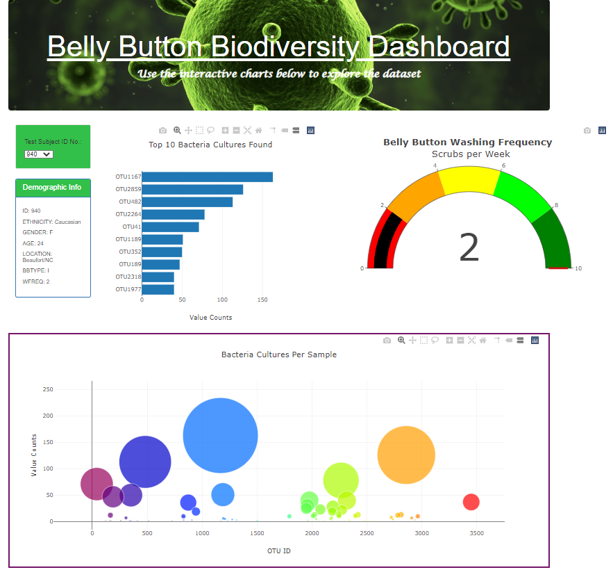

# Bellybutton_Biodiversity

## Project Overview:
This project was designed to visually reflect data collected on belly button bacteria. Each volunteer is 
reflected including id number, demographic information, top 10 cultures found, belly button washing frequency, 
and bacteria cultures per sample. This information was collected to determine if 'Improbable Beef' could identify 
samples of bacteria that would be viable for their development. 

#### Resources:
Software: JavaScript, HTML, Bootstrap, GitHub Pages

Link to project GitHub Pages [Here](https://leisul.github.io/Bellybutton_Biodiversity/)

The green dot identifiers reflect the changes in the html code to customize the page and content view.

